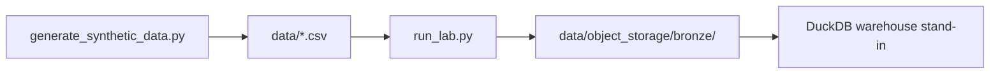

# OCI Data Platform Lab (Local Simulation, Synthetic)

**Author:** Faiz Elahi · **Type:** EDUCATIONAL PORTFOLIO LAB · **SYNTHETIC DATA ONLY**

---

## Educational disclaimer / synthetic data

This lab **simulates** Oracle Cloud Infrastructure patterns—**Object Storage bronze** folders and warehouse-style SQL—on **synthetic HCM and EBS GL extracts**. It does **not** create OCI tenancies, buckets, or Autonomous Database instances.

Use honest language: *“I copied bronze HR and GL CSVs locally and ran headcount and ledger SQL like an OCI analytics pattern.”*

---

## Problem statement (detailed)

Enterprise analytics on OCI often lands **Fusion HCM** and **EBS GL** feeds in **Object Storage**, then queries them with SQL engines (Autonomous Data Warehouse, Spark, etc.). Finance and HR stakeholders ask:

- **Headcount and salary** by job code from HCM
- **Debit/credit totals** by ledger from GL journals

This lab uses `hcm_employees.csv` and `ebs_gl_journals.csv`, copies them into `data/object_storage/bronze/`, and runs aggregations in DuckDB as a stand-in for ADW external tables.

---

## Why this tool

| Cloud trial complexity | This lab pipeline |
|------------------------|-------------------|
| Tenancy setup | Local bronze folder metaphor |
| Opaque ERP exports | Documented CSV dictionaries |
| Single subject area | HR + finance together |

Pairs with **`hr-analytics-one-model-lab`** and **`aws-health-finance-lake-lab`**.

---

## Architecture



See [`docs/architecture.md`](docs/architecture.md).

---

## Dataset dictionary (tables / columns)

| File | Grain | Key columns | Notes |
|------|-------|-------------|-------|
| `hcm_employees.csv` | Employee | `employee_id`, `job_code`, `department`, `salary_usd`, `hire_date` | Synthetic HCM |
| `ebs_gl_journals.csv` | Journal line | `journal_id`, `ledger`, `account`, `debit`, `credit`, `posted_date` | Synthetic GL |
| `object_storage/bronze/*.csv` | Copy of above | Same columns | Bronze landing mimic |

---

## Prerequisites

- Python 3.10+
- `duckdb` (see `requirements.txt`)

---

## Step-by-step: how to run

### Windows PowerShell

```powershell
cd oci-data-platform-lab
python -m venv .venv
.\.venv\Scripts\Activate.ps1
pip install -r requirements.txt
python scripts/generate_synthetic_data.py
python -m src.run_lab
python scripts/generate_charts.py
```

### Optional bash

```bash
cd oci-data-platform-lab
python3 -m venv .venv && source .venv/bin/activate
pip install -r requirements.txt
python scripts/generate_synthetic_data.py
python -m src.run_lab
python scripts/generate_charts.py
```

---

## File-by-file walkthrough

| Path | Role |
|------|------|
| `scripts/generate_synthetic_data.py` | HCM and GL journal CSVs |
| `src/run_lab.py` | Copies to bronze path; prints headcount/salary and ledger totals |
| `scripts/generate_charts.py` | Optional charts in `docs/images/` |
| `docs/architecture.md` | OCI service mapping notes |

---

## Expected outputs and how to interpret them

- Console **headcount by job_code** with average salary.
- Console **sum debit/credit by ledger**—discuss balance checks in exercises.
- Bronze copies under **`data/object_storage/bronze/`** mirror immutable landing files.

---

## Results interpretation

- **Average salary** is synthetic—not compensation benchmarking.
- GL **debit/credit** may not tie to a full chart of accounts—teaching grain only.
- Job codes are simplified vs real Fusion workforce structures.

---

## Glossary (8+ terms)

1. **OCI** — Oracle Cloud Infrastructure.
2. **Object Storage** — OCI bucket service; simulated as local bronze folder.
3. **HCM** — Human Capital Management cloud (Fusion).
4. **EBS** — Oracle E-Business Suite; GL journals metaphor.
5. **Bronze landing** — First persistence of source extracts.
6. **ADW** — Autonomous Data Warehouse; DuckDB stands in locally.
7. **Ledger** — GL boundary for journal totals.
8. **Job code** — Workforce classification dimension.
9. **External table** — SQL over files in object storage (conceptual).

---

## Common mistakes (5+)

1. Claiming **OCI certification or production ERP integration** from this repo.
2. Joining **HCM to GL** on fake keys without documenting conformed dimensions.
3. Ignoring **currency** on multi-country GL (not modeled).
4. Using **synthetic payroll** in real compensation decisions.
5. Skipping **IAM and vault** discussion for ERP extract credentials.
6. Forgetting to **regenerate CSVs** before demoing bronze copies.

---

## Exercises (5+)

1. Add **department-level headcount** export CSV.
2. Validate **debit = credit** per journal_id where applicable.
3. Sketch **OCI Data Integration** pipeline diagram from bronze to ADW external table.
4. Compare employee counts to **`hr-analytics-one-model-lab`** themes in prose.
5. Add **effective-dated** job history table in generator (SCD Type 2 stretch).
6. Document **SOX controls** on GL ingest (conceptual).

---

## Limitations / simulation vs production

- No OCI CLI, Resource Manager, or Autonomous Database connectivity.
- Simplified ERP fields—not full Oracle canonical models.
- Educational code—**not financial or HR compliance reporting**.

---

## Related labs

- [`hr-analytics-one-model-lab`](../hr-analytics-one-model-lab/) — People analytics mart.
- [`aws-health-finance-lake-lab`](../aws-health-finance-lake-lab/) — Another cloud lake metaphor.
- [`terraform-multicloud-landing-zone-lab`](../terraform-multicloud-landing-zone-lab/) — Multicloud IaC.

---

**Author:** Faiz Elahi · Educational portfolio use.
